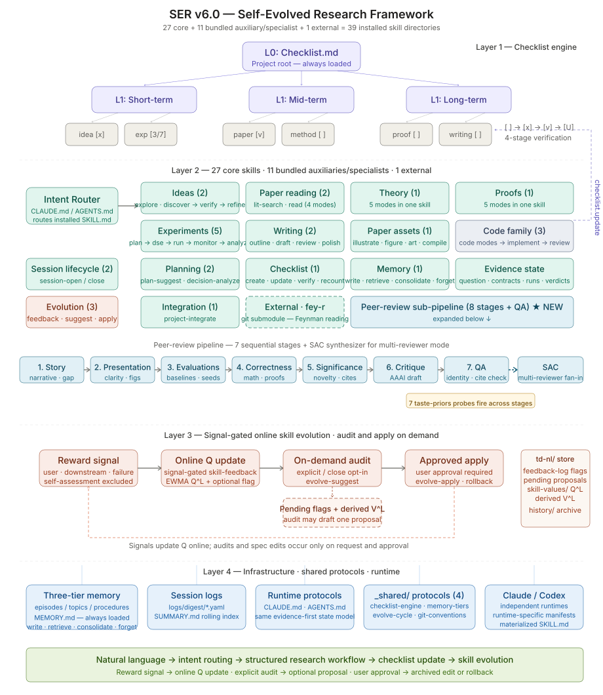

# SER — Self-Evolved Research

> A behavior-driven research framework for [Claude Code](https://docs.anthropic.com/en/docs/claude-code)
> and Codex.
> Skills trigger automatically. The framework improves its own skills through use.
>
> **[中文版 README](README.zh-CN.md)**

<p align="center">
  
</p>

## What It Does

You talk naturally. SER detects your intent and routes to the right micro-skill:

| You say | SER triggers |
|---------|-------------|
| "I'm reading this paper..." | `paper-read` — structured notes |
| "Search arXiv for X" | `paper-lit-search` — arXiv + Semantic Scholar |
| "Is this proof correct?" | `proof` (critique mode) — step-by-step check |
| "Prove that …" | `proof` (write mode) — first draft of the proof |
| "What should I do next?" | `plan-suggest` — prioritized tasks |
| "Design the experiment" | `experiment-plan` — claims / variables / baselines |
| "Sweep these hyperparameters" | `experiment-dse` — search strategy + configs |
| "Run the experiment" | `experiment-run` — contract-gated launch via `harness ext-launch` |
| "Any novel ideas for X?" | `idea` (discover) → `idea-verify` → `idea` (refine) |
| "Write the introduction" | `writing` (draft mode) — section draft |
| "Plot the results as a bar chart" | `paper-assets` (figure mode) — PGFPlots / matplotlib |
| "Compile the paper" | `paper-assets` (compile mode) — `scripts/compile_paper.sh` |
| "Implement this feature" | `code` (ROADMAP) → `code-implement` → `code-review` → `code` (COMMIT) |
| (end conversation) | `session-close` — evidence-first wrap-up |

When a skill execution produces a real reward signal, SER records feedback.
Over sessions, SER can propose improvements to its own skill specs via natural
language TD learning — the skills you use today become better tomorrow.

## Getting Started

### 1. Clone

```bash
git clone --recurse-submodules https://github.com/Shiien/Self-Evolved-Research-Framework.git
cd Self-Evolved-Research-Framework
```

> **Already cloned without `--recurse-submodules`?** Run:
> ```bash
> git submodule update --init --recursive
> ```

### 2. Run Setup

```bash
bash scripts/setup.sh
```

This creates `config.yaml`, initializes the memory system, and sets up all required directories. Safe to run multiple times.

### 3. Configure Your Project

Edit `config.yaml` with your project details:

```yaml
project:
  name: "Your Research Project"
  status: "phase-0-exploration"
  created_at: "2026-03-19"

research:
  domain: "Your Domain"
  sub_domain: "Your Sub-Domain"
  keywords: [...]
```

### 4. Choose a Runtime and Start Working

Claude Code and Codex are independent single-model runtimes. Each runtime
executes the complete SER workflow directly; neither runtime calls the other.

For Claude Code:

```bash
claude
```

SER will automatically:
1. Inject deterministic session context via the `SessionStart` hook (`scripts/session_context.sh`)
2. Show a status banner (`session-open`) — research question, experiment ledger, last run
3. Wait for your research request — no commands needed

For Codex, install the Codex manifests first (see below), then run `codex`.

### 5. Install Skills

The installer defaults to the Claude runtime. It selects
`SKILL.claude.md` before a runtime-neutral `SKILL.md` and installs into
`.claude/skills/`:

```bash
bash scripts/install-skills.sh            # copy into ./.claude/skills
bash scripts/install-skills.sh --link     # link neutral manifests; copy native manifests
bash scripts/install-skills.sh --user     # install into ~/.claude/skills
bash scripts/install-skills.sh --list     # list discovered skills
bash scripts/install-skills.sh --dry-run  # preview without writing
bash scripts/install-skills.sh --force    # overwrite existing skills
```

**Selective install** — pick or drop skill families:

```bash
bash scripts/install-skills.sh --only 'paper-*'
bash scripts/install-skills.sh --only 'code*,paper-assets'
bash scripts/install-skills.sh --exclude 'theory,proof'
```

For Codex, select the Codex runtime explicitly. It selects
`SKILL.openai.md` before a runtime-neutral `SKILL.md` and writes materialized
copies to `.agents/skills/`:

```bash
bash scripts/install-skills.sh --runtime codex
codex
```

Four judgment-heavy responsibilities remain independent skills on both
runtimes: `code-implement`, `code-review`, `idea-verify`, and
`writing-review`. Their runtime-specific single-model manifests are executed
by the active runtime itself.

Claude `--link` installs a symlink only when the source is a runtime-neutral
`SKILL.md`. When a skill has a runtime-native manifest, the installer
materializes a copy as the installed `SKILL.md`. Codex installations are
always project-local materialized copies; `--link` and `--user` are not
supported with `--runtime codex`.

## Skills (27 core SER + 11 bundled auxiliary/specialist + 1 external)

Each skill lives in `skills/{skill-name}/` with standard YAML frontmatter.
Most use a neutral `SKILL.md`; runtime-specific skills use
`SKILL.claude.md` and `SKILL.openai.md`, materialized as `SKILL.md` during
installation.

A fresh unfiltered installation creates **39 skill directories**. The table
below lists the **27 core SER skills** consolidated from the original 57 (see
`REFACTOR_PLAN.md §7`). The 11 bundled directories not counted as core are:

- the `peer-review` coordinator;
- nine peer-review specialists: `peer-review-correctness`,
  `peer-review-critique`, `peer-review-evaluations`, `peer-review-for-ddl`,
  `peer-review-presentation`, `peer-review-qa`, `peer-review-sac`,
  `peer-review-significance`, and `peer-review-story`;
- the special-purpose `play-tic-tac-toe` skill.

The final directory is the external `fey-r` skill described below.

| Category | Skills | Purpose |
|----------|--------|---------|
| **Session** | `session-open`, `session-close` | Lifecycle: status banner, auto-save |
| **Paper reading** | `paper-read` (standard / deep / compare / index modes), `paper-lit-search` | Reading, comparison, arXiv + Semantic Scholar search |
| **Paper writing** | `writing` (OUTLINE / DRAFT / POLISH modes), `writing-review` | Outline → draft → peer-review → polish |
| **Paper build** | `paper-assets` (illustrate / figure / art / compile modes) | Architecture diagrams, data plots, pixel art, LaTeX build (`scripts/compile_paper.sh`) |
| **Theory** | `theory` (formalize / decompose / search / counterexample / generalize modes) | Formalization & proof strategy |
| **Proof** | `proof` (write / critique / fix / formalize / verify modes) | First draft → review → repair → publication LaTeX → spot-check |
| **Ideas** | `idea` (EXPLORE / DISCOVER / REFINE modes), `idea-verify` | Directions → gap analysis → novelty check → sharpened proposal |
| **Experiment** | `experiment-plan`, `experiment-dse`, `experiment-run`, `experiment-monitor` (thin, over `harness ext-status`), `experiment-analyze` | Contract → sweep → dispatch → monitor → evaluate |
| **Coding** | `code` (BRANCH / ROADMAP / DEBUG / COMMIT modes), `code-implement`, `code-review` | Plan → branch → implement → debug → review → commit |
| **Planning** | `plan-suggest` (+milestone mode), `decision-analyze` (+converge mode) | Project management (status → `python -m harness status`; progress reports → `checklist`) |
| **Checklist** | `checklist` (modes: create / update / verify / recount) | Paper audit & claim tracking |
| **Memory** | `memory` (modes: write / retrieve / consolidate / forget) | Persistent cross-session memory |
| **Meta** | `skill-feedback`, `evolve-suggest`, `evolve-apply` | TD-NL skill self-improvement |
| **Integration** | `project-integrate` | Merge SER into an existing project |

## External Skills

| Skill | Source | Purpose |
|-------|--------|---------|
| [Fey-R](https://github.com/xvirobotics/fey-r) | `skills/external/fey-r/` | Interactive Feynman-method paper reading — deeply understand papers by recreating the author's derivation |

External skills are installed as git submodules and initialized automatically by `scripts/setup.sh`.
To add your own, use `git submodule add <url> skills/external/<name>/`.

## Skill Evolution (TD-NL)

SER updates skill values only when use produces a real reward signal. Audits
and spec edits remain explicit and approval-gated:

```
real reward signal → signal-gated skill-feedback
                   → online EWMA Q update + optional pending flag

explicit audit or session-close opt-in → evolve-suggest
                                       → inspect pending flags, derive V^L,
                                         optionally draft one proposal

user approves proposal → evolve-apply → archive + edit (or approved rollback)
```

The optimization target is the skill specs themselves (`skills/{skill-name}/SKILL.md`).
Version history in `skills/td-nl/history/` enables safe rollback.

## Research Harness

Experiments (currently the TTT skill-evolution experiment) run through one
canonical, contract-gated path — see `REFACTOR_PLAN.md` for design and
`RESEARCH_STATE.md` / `EXPERIMENTS.json` for live research state:

```bash
python -m harness setup                          # environment check
python -m harness smoke-test                     # full deterministic test suite
python -m harness run configs/ttt_smoke.yaml     # one experiment -> runs/<id>/
python -m harness evaluate <run>                 # (re-)evaluate vs the contract
python -m harness resume <run>                   # finish a failed/partial run
python -m harness compare <run> <run> ...        # metric/verdict table
python -m harness loop step                      # run the next planned experiment
```

Every run directory is self-contained (resolved config, contract + hash, seed
and git metadata, logs, metrics, checkpoints, evaluation, failure info,
summary). An experiment is complete only after its evaluation has run.

## Project Structure

```
├── CLAUDE.md              # Research protocol (loop, state model, intent router)
├── AGENTS.md              # Codex-native version of the v6 research protocol
├── .agents/skills/        # Materialized Codex skill installation target
├── RESEARCH_STATE.md      # Scientific state: question, hypotheses, evidence
├── EXPERIMENTS.json       # Experiment ledger (planned/running/complete + verdicts)
├── IDEA_BACKLOG.md        # Out-of-scope ideas parked with revisit conditions
├── harness/               # Minimal research harness (contract, rundir, cli, loop)
├── configs/               # Experiment configs, each with a pre-registered contract
├── runs/                  # Self-contained run records
├── config.template.yaml   # Copy to config.yaml and customize
├── README.md / LICENSE
├── skills/
│   ├── {skill-name}/      # 27 core + 11 bundled auxiliary/specialist skills
│   ├── _shared/           # Shared infra read by related skills
│   │   ├── checklist-engine.md
│   │   ├── memory-tiers.md
│   │   ├── evolve-cycle.md
│   │   └── git-conventions.md      # Shared git workflow
│   ├── external/          # External skills (git submodules)
│   │   └── fey-r/         # Feynman-method paper reading
│   └── td-nl/             # Skill evolution infrastructure
│       ├── feedback-log.md
│       ├── value-function.md
│       ├── skill-values/   # Per-skill Q^L estimates
│       └── history/        # Spec version archive for rollback
├── scripts/               # session_context.sh (SessionStart hook), citation, notify, install-skills
├── memory/                # Persistent three-tier memory
│   ├── episodes/          # Recent observations (7-day retention)
│   ├── topics/            # Consolidated knowledge (90-day)
│   └── procedures/        # Permanent processes
├── background/            # Research background materials
├── methodology/           # Research methods + ideas
├── experiments/           # Experiment code + results
├── outputs/               # Deliverables (short/mid/long-term + paper/)
├── resources/             # Reference materials (papers/ + repos/)
├── logs/                  # experiments/ (external GPU runs) + digest/ (optional narrative logs)
└── docs/                  # Plans, reports
```

## How the Runtime Protocols Work

Claude Code reads `CLAUDE.md`; Codex reads `AGENTS.md`. These independent
runtime protocols implement the same evidence-first state model and define:

- **Intent router**: lifecycle-stage-grouped patterns that map your messages to SER skills
- **Session lifecycle**: open from canonical state; close by persisting evidence and unresolved work to its canonical owner
- **Data contracts**: standardized formats for research state, experiment records, paper notes, and memory files
- **Evolution loop**: signal-gated online Q updates, optional audits, and user-approved spec edits

Claude namespace guides provide additional scoped context in subdirectories.
For Codex, `AGENTS.md` is the root behavioral protocol and installed
materialized `SKILL.md` files supply the runtime-specific workflows.

## Typical Workflows

### Daily Research

```
(open claude)
→ session-open shows status banner

"I want to continue reading the LAPA paper"
→ paper-read generates structured notes

"Is this derivation step correct? [paste]"
→ proof (critique mode) checks it

"That's it for today"
→ session-close persists evidence, ledger changes, and unresolved work to canonical state
→ evolve-suggest runs only if the user explicitly requests or opts in to an audit
```

### Idea Exploration

```
"What are the open problems in agent memory?"
→ idea (discover mode) generates candidates

"Is the second idea novel?"
→ idea-verify checks against existing literature

"Let's go with that direction"
→ decision-analyze records the choice
```

### Paper Writing

```
"Time to start writing"
→ writing (outline mode) generates structure

"Write the introduction"
→ writing (draft mode) produces a draft

"Review this version"
→ writing-review evaluates the draft in the active runtime

"Compile the paper"
→ paper-assets (compile mode) runs scripts/compile_paper.sh, reports errors
```

### Experiment Lifecycle

```
"Design an experiment to test claim C"
→ experiment-plan writes claims / variables / baselines

"Sweep the learning rate and batch size"
→ experiment-dse generates configs + runs them with early stopping

"Launch it"
→ experiment-run dispatches (GPU pre-flight + SSH aware)

"Analyze the results"
→ experiment-analyze → paper-assets (figure mode) renders publication-ready plots
```

### Coding Workflow

```
"Start a branch for the ingest refactor"
→ code (BRANCH mode) creates feat/... and (optionally) a worktree

"Plan the refactor first"
→ code (ROADMAP mode) breaks it into steps

"Implement step 2"
→ code-implement executes the roadmap in the active runtime

"Review the diff"
→ code-review reviews the completed diff in the active runtime

"Commit"
→ code (COMMIT mode) following shared git conventions
```

## License

MIT — See [LICENSE](LICENSE)
